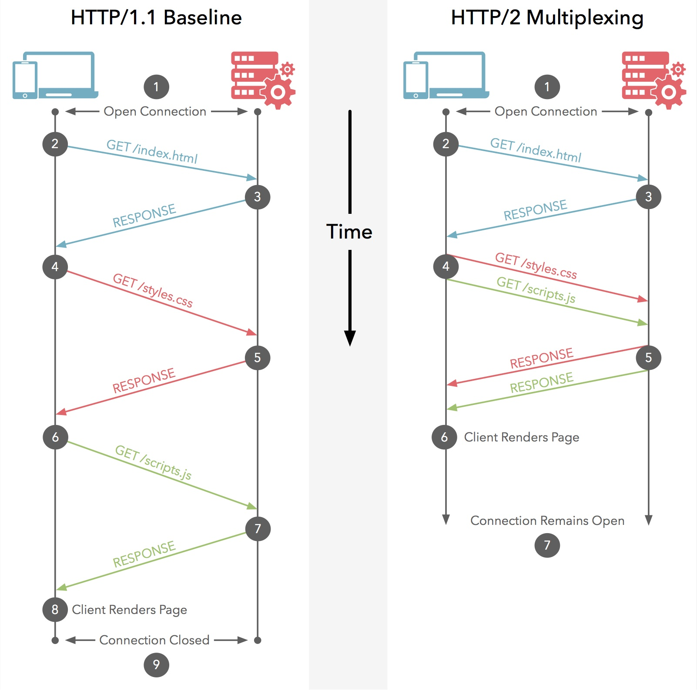

## 1 HTTP 优化

影响 HTTP 网络请求的因素：

* 带宽
* 延迟
  - 线头器阻塞（HOL Blocking）：是一种出现在[缓存](https://baike.baidu.com/item/缓存)式通信网络交换中的一种现象。交换通常由[缓存](https://baike.baidu.com/item/缓存)式输入端口、一个交换架构以及缓存式输出端口组成。**当在相同的输入端口上到达的包被指向不同的输出端口的时候就会出现线头阻塞**。
  - DNS查询（DNS Lookup）
  - 建立连接（Initial connection）

## 2 HTTP 

### 2.1 HTTP 1.0 

* 请求与响应支持 HTTP 头，响应含状态行，增加了状态码
* 支持 HEAD，POST 方法
* 支持传输 HTML 文件以外其他类型的内容

缺点：

* **非持久连接**：客户端必须为每一个待请求的对象建立并维护一个新的连接，短连接增加了网络传输的负担

### 2.2 HTTP 1.1

* 支持**长连接**
* 在HTTP1.0的基础上引入了更多的缓存控制策略
* 引入了**请求范围**设置，优化了带宽
* 在错误通知管理中新增了错误状态响应码
* 增加了Host头处理，可以传递主机名（hostname）

### 2.3 HTTPS

- HTTPS 运行在安全套接字协议(Secure Sockets Layer，**SSL** )或传输层安全协议（Transport Layer Security，**TLS**）之上，所有在TCP中传输的内容都需要经过加密。
- 连接方式不同，HTTP的端口是 80，HTTPS的端口是 443.
- HTTPS 可以有效防止运营商劫持。

### 2.4 HTTP 1.x优化（SPDY）

SPDY ：**在 HTTP 之前做了一层会话层**，为了达到减少页面加载时间的目标，SPDY 引入了一个新的二进制分帧数据层，以实现优先次序、最小化及消除不必要的网络延迟，目的是更有效地利用底层 TCP 连接。

- 多路复用，为多路复用设立了请求优先级
- 对 header 部分进行了压缩
- 引入了 HTTPS 加密传输
- 客户端可以在缓存中取到之前请求的内容

### 2.5 HTTP 2.0

* 使用二进制分帧层：在应用层与传输层之间增加一个二进制分帧层
* **多路复用**
* 服务端推送：logo、CSS 文件直接推给客户端
* 数据流优先级：对数据流可以设置优先值，比如设置先传 css 文件等
* 头部压缩
* 支持明文传输，HTTP 1.X 使用 SSL/TLS 加密传输。

### 2.6 HTTP 3.0（QUIC）

QUIC (Quick UDP Internet Connections)，快速 UDP 互联网连接，基于 **UDP 协议**的。

#### 2.6.1 线头阻塞(HOL)问题的解决更为彻底

基于TCP的HTTP/2，尽管从逻辑上来说，不同的流之间相互独立，不会相互影响，但在实际传输方面，数据还是要一帧一帧的发送和接收，一旦某一个流的数据有丢包，则同样会阻塞在它之后传输的流数据传输。而基于 UDP 的 **QUIC 协议**则可以更为彻底地解决这样的问题，让不同的流之间真正的实现相互独立传输，互不干扰。

#### 2.6.2 切换网络时的连接保持

当前移动端的应用环境，用户的网络可能会经常切换，比如从办公室或家里出门，WiFi断开，网络切换为 3G 或 4G。基于TCP的协议，由于切换网络之后，IP会改变，因而之前的连接不可能继续保持。而基于 UD P的 QUIC 协议，则可以内建与 TCP 中不同的连接标识方法，从而在网络完成切换之后，恢复之前与服务器的连接。