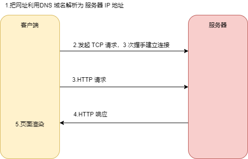
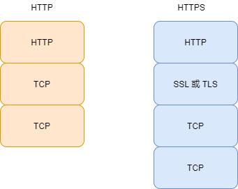
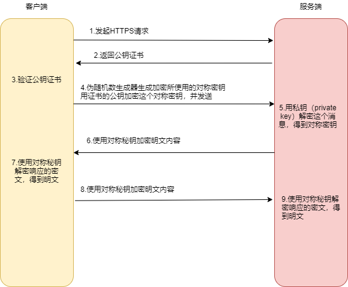

## 1 HTTP

### 1.1 简介

* HTTP协议是Hyper Text Transfer Protocol（超文本传输协议）缩写。

* 基于 TCP/IP 通信协议来传输数据。
* 属于应用层协议。
* 基于客户端-服务端架构（B/S）。

### 1.2 特点

* 简单快速：只需传送请求方法和路径。请求方法常用的有GET、HEAD、POST。由于简单，因而通信速度很快。

* 灵活：HTTP 允许传输任意类型的数据对象，传输的类型由 Content-Type 标记。

* 无连接：限制每次连接只处理一个请求。服务器处理完客户的请求，并收到客户的应答后，即断开连接，传输时间。

* 无状态：指协议对于事务处理没有记忆能力，后续处理需要前面的信息，必须重传，导致每次连接传送的数据量增大。但，在不需要先前信息时应答快。

### 1.3 URL和URI

HTTP使用统一资源标识符（Uniform Resource Identifiers, URI）来传输数据和建立连接。

- URI：Uniform Resource Identifier 统一资源**标识**符：标示 一个具体的资源的，通过 URI 知道一个资源是什么。
- URL：Uniform Resource Location 统一资源**定位**符：用来定位具体的资源的，标示了一个具体的资源位置。互联网上的每个文件都有一个唯一的URL，URL 是一种特殊类型的URI。

### 1.4 报文组成

请求报文:

* 请求行：包括请求方法、URL、协议/版本
* 请求头(Request Header)

* 请求正文

```java
GET / HTTP1.1             
Host:https://wanandroid.com/
User-Agent:Mozilla/5.0 (Linux; Android 6.0; Nexus 5 Build/MRA58N) AppleWebKit/537.36 (KHTML, like Gecko) Chrome/86.0.4240.198 Mobile Safari/537.36
Content-Type:application/json;charset=UTF-8
Content-Length:40
Connection:Keep-Alive

name: "test"
```

响应报文:

* 状态行

* 响应头

* 响应正文

```java
HTTP/1.1 200 OK
Content-Type: application/json;charset=UTF-8
Date: Wed, 03 Feb 2020 09:47:32 GMT

{"data":[{"children":[],"courseId":1    
```

### 1.5 原理

* 基于 TCP/IP 通信协议来传递数据的协议
* 用于 B/S 架构
* 默认端口 80 



### 1.6 常见请求方式

- GET:请求指定的页面信息，并返回实体主体。
- POST:向指定资源提交数据进行处理请求（例如提交表单或者上传文件）。数据被包含在请求体中。POST请求可能会导致新的资源的建立和/或已有资源的修改。
- HEAD:类似于get请求，只不过返回的响应中没有具体的内容，用于获取报头
- PUT:从客户端向服务器传送的数据取代指定的文档的内容。
- DELETE:请求服务器删除指定的页面。

### 1.7 POST 和 GET 区别

* post更安全（不会作为url的一部分，不会被缓存、保存在服务器日志、以及浏览器浏览记录中）
* post发送的数据更大，get有 url 长度限制
* 都包含请求头请求行，post多了请求body
* post能发送更多的数据类型（get只能发送ASCII字符）
* post用于修改和写入数据，get用于拉取数据

### 1.5 状态码

**状态码分类**：

- 1XX：信息，服务器收到请求，需要请求者继续操作。
- 2XX：成功，请求成功收到，理解并处理。
- 3XX ：重定向，需要进一步的操作以完成请求。
- 4XX ：客户端错误，请求包含语法错误或无法完成请求。
- 5XX ：服务器错误，服务器在处理请求的过程中发生了错误。

**常见状态码**：

- 200 OK - 客户端请求成功
- 301 - 资源（网页等）被永久转移到其它URL
- 302 - 临时跳转
- 400 Bad Request - 客户端请求有语法错误，不能被服务器所理解
- 401 Unauthorized - 请求未经授权，这个状态代码必须和WWW-Authenticate报头域一起使用
- 403 - 禁止访问
- 404 - 请求资源不存在，可能是输入了错误的URL
- 500 - 服务器内部发生了不可预期的错误
- 503 Server Unavailable - 服务器当前不能处理客户端的请求，一段时间后可能恢复正常。

## 2 HTTPS

## 2.1 简介

HTTPS （全称：Hyper Text Transfer Protocol over SecureSocket Layer），是以安全为目标的 HTTP 通道，其实就是  **HTTP+SSL/TLS**。

SSL（Secure Socket Layer，**安全套接字层**）：1994年为 Netscape 所研发，SSL 协议位于 TCP/IP 协议与各种应用层协议之间，为数据通讯提供安全支持。

TLS（Transport Layer Security，**传输层安全**）：其前身是 SSL，它最初的几个版本（SSL 1.0、SSL 2.0、SSL 3.0）由网景公司开发，1999年从 3.1 开始被 IETF 标准化并改名，发展至今已经有 TLS 1.0、TLS 1.1、TLS 1.2 三个版本。SSL3.0和TLS1.0由于存在安全漏洞，已经很少被使用到。TLS 1.3 改动会比较大，目前还在草案阶段，目前使用最广泛的是TLS 1.1、TLS 1.2。



使用 HTTP 可能有如下的风险：

* 窃听，可以通过抓包获取信息，而且传输内容为明文
* 篡改：传输内容被修改
* 冒充：冒充客户端或服务端，提供不正确的信息

### 2.1 原理

* 其实就是   **HTTP+SSL/TLS**
* 默认端口为 443



1. 客户端发起一个HTTPS的请求，HTTPS  服务端默认的 443 端口。

2. 服务器把事先配置好的公钥证书（public key certificate）返回给客户端。
3. 客户端验证公钥证书合法性：例如有效期、站点、颁发机构等，不合法显示警告。
4. 客户端使用伪随机数生成器生成加密所使用的对称密钥，然后用证书的公钥加密这个对称密钥，发给服务端。
5. 服务端使用的私钥（private key）解密这个消息，得到对称密钥。这样客户端和服务端都持有了相同的对称密钥。
6. 服务端使用对称密钥加密“明文内容A”，发送给客户端。
7. 客户端使用对称密钥解密响应的密文，得到“明文内容A”。
8. 客户端使用对称密钥加密“明文内容B”，发送给服务端。
9. 服务端使用对称密钥解密响应的密文，得到“明文内容B”。来来往往

## 3 参考阅读

* [深入理解HTTPS工作原理](https://segmentfault.com/a/1190000018992153)
* [十分钟搞懂HTTP和HTTPS协议？](https://zhuanlan.zhihu.com/p/72616216)
* [HTTPS系列干货（一）：HTTPS 原理详解](https://zhuanlan.zhihu.com/p/27395037)

